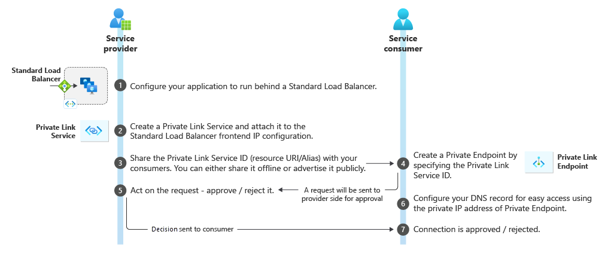
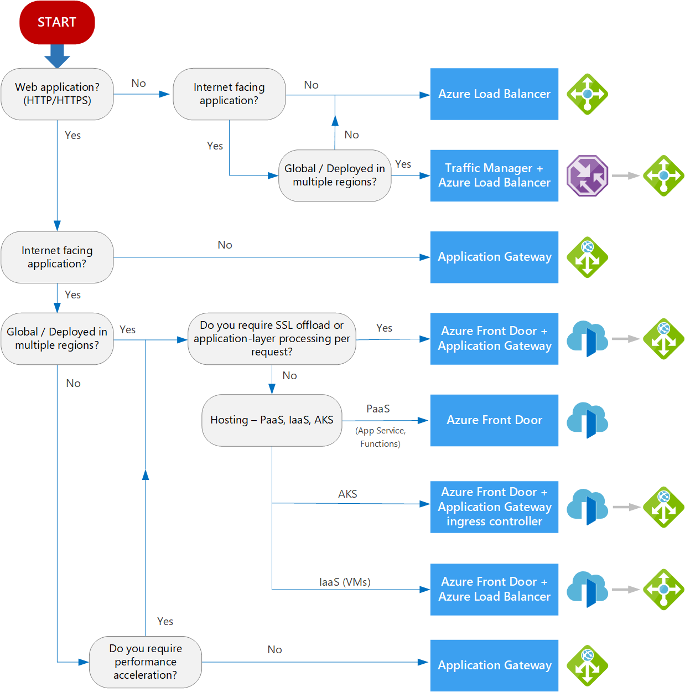
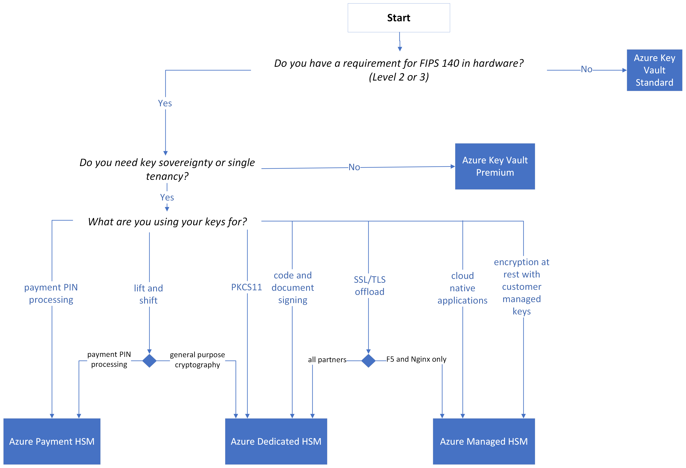

# Preps for AZ-500 certification
Welcome to this study preparation material help. 

Just to note that, I put it here assuming this might help someone in their preparation journey. Do not trust these contents here without verifying, does not come with any guarantee. Also, this is not a full-blown guide nor official guide for the preparation of this exam

## Prerequisites

* Read about the exam page from Microsoft learn [here](https://learn.microsoft.com/en-us/credentials/certifications/azure-security-engineer/?practice-assessment-type=certification)

## Study guide
[Local copy](./studyguide.md), always refer official documentation

## Tips to know about Azure resources
1. Azure AD:
   * Risk detections: Risk detections (e.g. Leaked credentials [nonPremium]) and Risk types (nonPremium vs. Premium)
   * Azure AD security history: 
        - Started with Username+password
        - Then came: Optional MFA
        - Then MFA with conditional access (P1) was released.
   * Security defaults (MFA mandatory and Free)
   * MFA status: (Does not denote how often MFA should be done)
      - `Disabled` - MFA Not in use
      - `Enabled` - User can choose to do MFA or not
      - `Enforced` - MFA should be activated before accessing resources
      - `Registration required` - Need to add phone etc. but does not have to MFA
      - `Conditional access`
   * App registration: This needs: client ID, Tenant ID, URI
   * Entitlement management: Used mainly for B2B and external identities, also provides multi-tenancy for single tenant apps
   * Entra Free: No individual features, No fine grained policies
   * Entra Free: Cannot turn off security defaults (to use conditional access)
   * App registration: All users can register an app
   * The `Authentication Policy Administrator` role can configure policies and create and manage verified credentials
   * Implement verified credentials one needs: `Authentication policy administrator`, `Contributor` and `Application administrator`
   * The `Privileged role administrators` can manage PIM
   * The `Global Administrator`, `Privileged Role Administrator`, `Application Administrator`, `Cloud Application Administrator` can provide admin consent
   * Entra administrative units: Delegate administrative responsibilities to single/group of people (not to be confused with Entitlement)
   * You can only use the Microsoft Authenticator app or one-time password login on shared devices. Windows Hello is the most safest but can only be used for Windows devices.
   * To perform a Azure Entra to AD:
        - Roles: Global Administrator on Azure Entra and Enterprise administrator on Windows AD
   * Connect the following resources with Entra/AD:
      - Azure SQL:
         - Azure ARC registered:
            - on-board the VM/Application to Azure
            - Option 1: user/password
            - Option 2: Integrated - User's windows credentials are authenticated against AD and token given to SQL Server
               - With/without MFA
            - Option 3: Service principal - client id/secret
            - Option 4: Managed Identity
            - Option 5: Access token
         - Azure SQL and others:
            - While selecting SQL server->Authentication->Set admin->(a) Entra only (b) Entra+SQL (c) SQL only
            - ref: https://learn.microsoft.com/en-us/azure/azure-sql/database/authentication-aad-configure?view=azuresql&tabs=azure-portal
            - More addition: Use Entra-password if there is no need for domain-joined. Use Entra-integrated for seamless
         - Contained Users in Database:
            - These are not admins
            - However, they can run `CREATE USER <> FROM EXTERNAL PROVIDER` 
         - TDE encryption:
            - Supports only RSA or RSA HSM encryption with 2048 and 3072 as supported lengths
      - Azure VMs:
         - Bastion
         - JIT - Is done through defender for cloud
         - AD login for windows and linux
         - RDP for Windows
         - SSH for linux - SSH with AD authentication (`az ssh`): enable extension, Azure RBAC 'VM adminstrator' to the user
      - Azure backup:
         - For VMs, the recommended approach is to use recovery services vault.
4. Azure devices
   * Azure AD registered, Azure AD join (not for on-prem), Hybrid Azure AD join (cloud+on-prem)
   * Reading: https://blog.quest.com/azure-ad-joined-devices-comparing-device-identities-in-active-directory-and-azure-ad/?trk=article-ssr-frontend-pulse_x-social-details_comments-action_comment-text AND
     https://www.linkedin.com/pulse/ad-joined-azure-hybrid-registered-devices-whats-komarovskiy-mba
5. Azure storage
   * Storage account:
      - SAS:
         - account (level) SAS: access to everything, cannot be managed with access policies
         - service (level) SAS: access to desired service, can be managed with access policies
      - On-prem AD domain services authorization not supported
      - Option `Secure transfer required` can be turned on at storage account level to reject insecure connections
      - Immutable policies: Can enable Write Once Read Many (WORM) state so data cannot be modified for defined period
      - Double encryption: If this is needed, then enable infra structure encryption
      - Storage account encryption: customer-managed and then you can select keyvault to store keys
   * Files:
      - On-prem AD domain services authorization supported: creds synced to Entra ID
      - Not supported by defender for cloud
6. Azure networking:
   - Private link services workflow
   
   - For containers running on VMs and to connect SaaS services via service endpoint connections: Azure virtual machine should enable CNI plugins
   - Azure automation: Implemented with Runbooks, but this can also trigger Logic Apps/functions etc. Purpose: Scheduling, maintenance, respond to alerts, automation etc.
   - UDR can be associated only to subnet and NIC
   - NSGs have two default rules which cannot be modified or removed.
   - An ASG can only be attached to NICs in the same VNet.
   - NSG's source and destination cannot be ASG (though different NSGs)
   - Azure network resources are always region specific (including NSGs and ASGs)
   - Traffic routing
   
7. Azure products:

   Azure apps:
      - Can be chosen to be single/multi tenant
      - To connect to a VNet, it needs a subnet delegation `serverFarms` and should not have connected resources. Service endpoints are fine.

   Azure keyvault:
      - soft delete if enabled is like a recycle bin (delete->delete permanently/recover )
      - purge protection (delete->recover until the purge protection period)
      - Key vault secret restoration can only happen to the vaults in the same region/paired-region and same Subscription
      - Key vault contributor cannot see data. For keys, secrets and certs you have `key vault` {Crypto, Secrets, Certificate} {user, officer}
      - Officers cannot manage permissions
      
   Azure HSM:
      - Advanced crypto and full soveriegnity, use dedicated HSM
      
   
   Azure VMs:
      - Disk encryption enablement: just pass the keyvault while VM creation, not need to store any secrets
      - Read-only lock: Cannot even start the VM !
   
   Azure SQL:
      - You can deploy an SQL managed instance to a dedicated virtual network subnet that does not have any resource connected. The subnet can have a service endpoint or can be delegated for a different service.

   Azure Runbook:
      - Process automation: E.g. rotate storage account keys and store in keyvault
      - Creates managed identity while creation

   Azure Log analytics:
      - Auto provisioning - provisions all vms for log analytics
      - Gives a broader view/analysis than activity logs

   Azure defender for cloud:
      - To enable JIT on a VM, it should have NSG or firewall
      - Enabling JIT: Defender, CLI or REST. No other options
      - This cannot block traffic itself, but can do so with NSGs, Firewalls etc.
      - Custom recommendations: You can create one under env settings and define a KQL query to trigger based on that
      - Workflow automation: Only with Logic apps
      - Azure files (in storage) not supported

   Azure sentinel:
      - This can trigger Azure logic apps
      - Is based only on Log Analytics
   
   Azure functions:
      - Pricing: Flex consumption (to zero instance, VNet), consumption (to zero), Premium (Vnet)

   Azure VPN gateways:
      - Plans: Basic (no active-active), VpnGw1-5 (route-based and policy based, VNet peering etc. 500Mbps-10Gbps)
   
   Azure Firewall:
      - Deploy: 
         - The firewall, VNet, and the public IP address all must be in the same resource group.
         - subnet specifically named `AzureFirewallSubnet` with a subnet size of /26.
         - With an SKU of Basic, you are required to create an `AzureFirewallManagementSubnet` also for management communications
         - SKU standard does not need that AzureFirewallManagementSubnet subnet
      - Firewall rule processing order:
         - Rule collection group (priority)
         - Rule collection (priority)
         - DNAT, Network, Application
      - E.g.: https://learn.microsoft.com/en-us/azure/firewall/rule-processing
   
   Azure FrontDoor:
      - Used for: Load balancing, SSL termination, intelligent traffic routing

## CLI example commands for practice

1. Identity and access
   - Create a user:
      `az ad user create --display-name $name --password $pass --user-principal-name test1@blabla.onmicrosoft.com`
      `New-AzAdUser -DisplayName $uname -PasswordProfile $pp -AccountEnabled $true -UserPrincipalName $upn`
   - List users:
      `az ad user list -o table`
      `Get-AzAdUser`
2. Secure compute, storage and databases
   - Storage account:
      `az storage account list`
      `Get-AzStorageAccount`